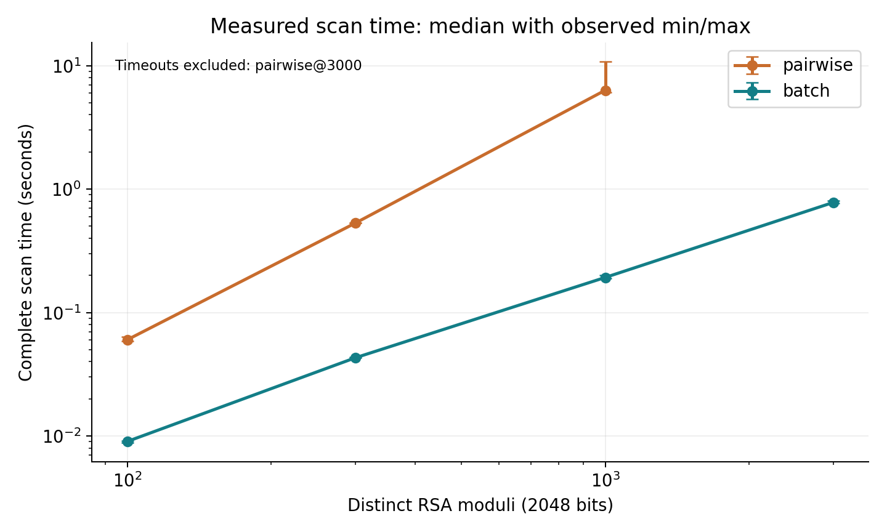
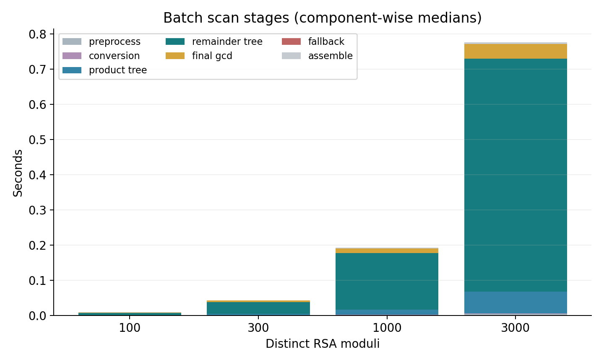
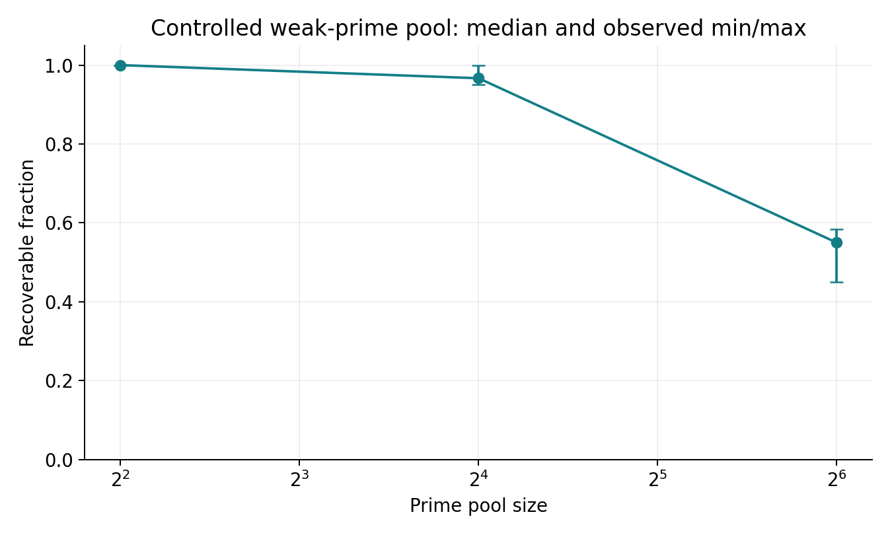

# 本机实测结果

所有数字来自交付中的原始 CSV 和 JSON。没有用估算填补超时结果。

## 攻击与修复

- 演示输入为 100 个不同的实际 2048-bit 模数，共 102 条记录。
- 独立预期可恢复 5 个不同模数，实际正确分解 5 个。
- OAEP 明文通过验证的不同模数为 5 个，密文记录为 6 条。
- 误报 0，遗漏 0，错误因子 0。
- 密钥更换后，当前集合检测到的可分解模数为 0 个。
- 三角结构触发回退，原始扫描细节保存在 demo/scan_batch.json。

## 性能

两算法调用同一 rsa_audit.scan_keys 引擎，使用相同固定数据与 gmpy2/GMP 后端，每条件 3 次，全新进程运行。计时采用 A 引擎的 total_seconds，包含记录校验、去重、后端转换、主算法、回退及结果组装。扫描计时不包含 B 接口转换、生成、I/O、恢复和评估。

| 不同模数数 | 实际可恢复数 | 两两 GCD 中位秒数 | 批量 GCD 中位秒数 | 两两/批量耗时比 |
|---|---|---|---|---|
| 100 | 6 | 0.060170 | 0.009033 | 6.66 倍 |
| 300 | 16 | 0.530128 | 0.043008 | 12.33 倍 |
| 1000 | 50 | 6.318309 | 0.192505 | 32.82 倍 |
| 3000 | 150 | 3/3 次超时 | 0.779880 | 不计算 |

完成的 21 次扫描均执行独立因子和 OAEP 明文验证。3000 规模的两两算法若显示超时，表示整个工作进程超过 45 秒限额，不代表它的完整扫描恰好耗时 45 秒。超时结果不进入中位数，也不计算对应提升倍数。

小规模真实弱比例见 data/bench/n-*/manifest.json 和 raw_results.csv。共享关系以整对安排，100 和 300 的比例略高于 5%，1000 与 3000 为 5%。每个规模两算法使用相同集合。

corpus 的素数及密钥构造用时约 124.19 秒，单独记录。这个时间不包括随后的所有文件保存和 OAEP 密文制作，因此不是整个数据准备命令的总墙钟耗时。

误差条表示三次观察值的最小与最大范围，不是置信区间。阶段图采用各阶段分别的中位数，分量中位数之和不一定等于总耗时中位数。

## 运行环境

- Python：3.10.11 (tags/v3.10.11:7d4cc5a, Apr  5 2023, 00:38:17) [MSC v.1929 64 bit (AMD64)]
- 平台：Windows-10-10.0.26200-SP0
- CPU：Intel64 Family 6 Model 154 Stepping 3, GenuineIntel，逻辑核数 20
- 物理内存：15.67 GiB
- 依赖版本：{'pycryptodome': '3.22.0', 'cryptography': '47.0.0', 'matplotlib': '3.9.2', 'gmpy2': '2.3.2'}
- 峰值 RSS：操作系统对整个扫描工作进程的记录，包含导入和输入，详见 CSV。

## 结论的边界

实验使用受控的本地弱密钥，不声称这些样本比例对应现实设备。提升倍数只对应当前数据、硬件和实现。重新扫描无共享因子只验证了当前集合的这一类关系。OAEP 解密说明私钥恢复后的影响，没有说明 OAEP 本身失效。

## 弱素数池扩展

固定每集合 60 把公钥，各条件实际结果如下。种子只控制选池槽位。

| 素数池大小 | 实际可恢复比例中位数 |
|---|---|
| 4 | 100.0% |
| 16 | 96.7% |
| 64 | 55.0% |

## 正负对照与覆盖范围

每种集合分别通过批量与两两检测，再独立核验因子和明文。

| 集合 | 算法 | 记录/不同模数 | 正确分解 | 验证明文 | 误报/遗漏 | 通过 |
|---|---|---|---|---|---|---|
| normal | batch | 100/100 | 0 | 0 | 0/0 | True |
| normal | pairwise | 100/100 | 0 | 0 | 0/0 | True |
| duplicates_only | batch | 102/100 | 0 | 0 | 0/0 | True |
| duplicates_only | pairwise | 102/100 | 0 | 0 | 0/0 | True |
| isolated_target | batch | 1/1 | 0 | 0 | 0/0 | True |
| isolated_target | pairwise | 1/1 | 0 | 0 | 0/0 | True |
| shared_prime_demo | batch | 102/100 | 5 | 6 | 0/0 | True |
| shared_prime_demo | pairwise | 102/100 | 5 | 6 | 0/0 | True |
| repaired | batch | 102/100 | 0 | 0 | 0/0 | True |
| repaired | pairwise | 102/100 | 0 | 0 | 0/0 | True |

这些集合的实际模数长度均为 2048 位。错误 OAEP label 和被修改的密文均被拒绝，2 项负向检查通过。孤立目标的零恢复结果说明攻击依赖其他公钥覆盖共享关系。两种算法共 10 次扫描，整体通过：True。
